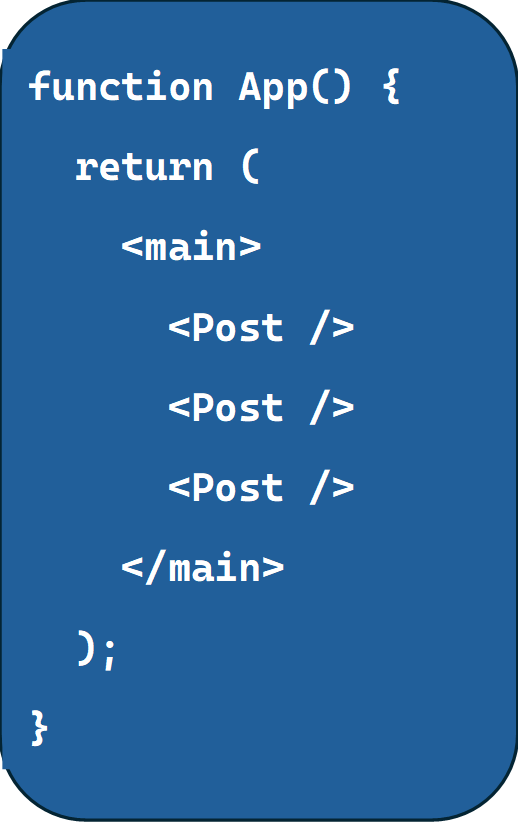

## Reusing Components

In React, components can be reused multiple times across your application. A good example is the Post component. Instead of having just one post, we may want to display multiple posts at once. This is a common scenario, especially in a real-world application where users might create several posts that need to be displayed.
Here's how you can reuse components:
```
1.	Open your App.jsx file and wrap the post components inside a <main> tag.
2.	Simply include the Post component multiple times inside the <main> tag.
```



Now, when you load the page, you’ll see multiple instances of the post component. And since React renders each component separately, the random name feature we added earlier will work independently for each post. This is one of the powerful aspects of React — components can be reused, and each instance is handled independently by React.
