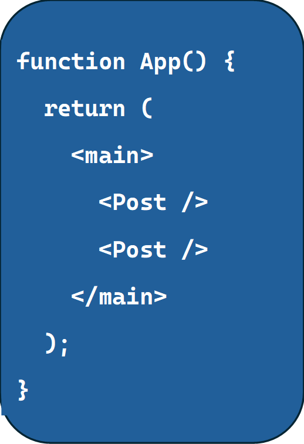
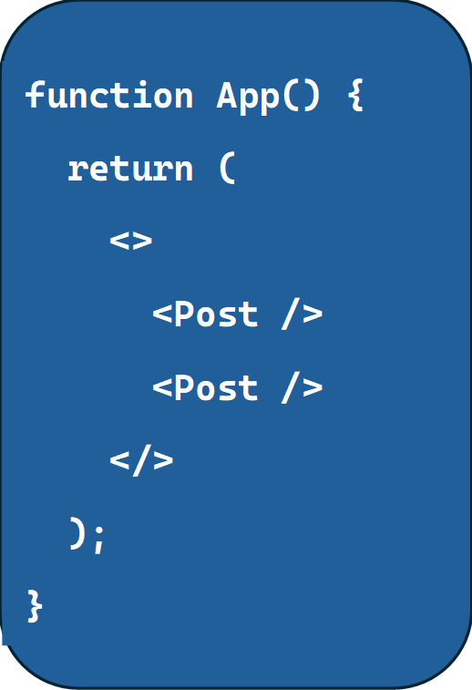

## JSX Rules and Restrictions

When working with JSX in React, there are some important rules to keep in mind:

```
1.	Single Root Element: In any component, your JSX must have one root element. If you try to return multiple sibling elements without wrapping them in a parent element, React will throw an error.

For example, this will cause an error:
```

```

To fix this, wrap the components inside a parent element like <main> or an empty tag:
```


Alternatively, you can use React fragments (<> </>) if you don’t want to add an extra HTML element:


```
2.	Self-Closing Tags: In JSX, if a component or element doesn’t have any content between the opening and closing tags, you must either use a self-closing tag or explicitly include both opening and closing tags.
```

For example, this works:


Or:


However, this will throw an error:


React requires you to always close your elements. This applies to both custom components (like Post) and built-in elements (like , <input />, etc.).
Conclusion
By reusing components and adhering to JSX rules, you can efficiently build dynamic and scalable UIs in React. React’s flexibility with components allows for seamless repetition of elements like posts while keeping each instance independent. Furthermore, understanding JSX limitations and syntax will ensure that your components function smoothly without unnecessary errors.

